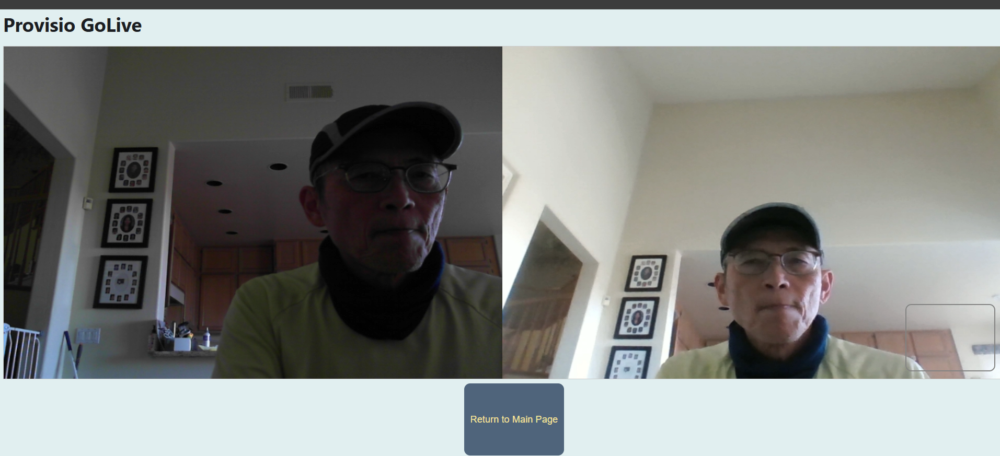

# Provisio SOP (original DocuMedium)

(09/24/2024)

Project is a documentation platform that integrates video playback, real-time interactions, and practice work submissions. This repository holds the project files necessary for the deployment of the platform. 


## Master Repo
https://github.com/simonisHereHelp/provisio_dep_0924
> ensure authorship, to maintain CDCI in Vercel
>
>git config user.name "simonisHereHelp"
>git config user.email "simon@isHere.help"
>


## Deployment Overview

The project is split across different services for video streaming, email handling, and app hosting.

### 1. **Streaming Video**
   - 960x720 handbrake 24fps
   - Video content is streamed from Vimeo.
   - Specific video resources:
     - `c71a.mp4` and `c72a.mp4` are hosted on Vimeo.
   - Vimeo is used to ensure seamless streaming and playback within the app's embedded player.
   - consolidated into one `7172-0926.mp4`on Vimeo

### 2. **Mail Service**
   - The mail service is responsible for sending notifications and user interaction updates.
   - The related GitHub repository for this service: `provisio_deploy_email`.
   - Deployed on [Render](https://render.com/).
   - SMTP server:
     - Server: `cheapname` SMTP server
     - Email: `simon@ishere.help`

```
(Render)

app = FastAPI()
     origins = [
    "https://provisio-dep-0924.vercel.app",          # Main Vercel deployment
    "https://provisio-*.vercel.app",        # Wildcard to allow any branch or preview deployment from Vercel
    "http://localhost:3000" , 

```

### 3. **App Hosting**
   - The main application repository: `provisio_sop(deploy)` on GitHub.
   - The app is deployed on [Vercel](https://vercel.com/).
   - Vercel provides the hosting for the front-end interface of DocuMedium.
   
>2x projects 
>
>https://provisio-dep-0924.vercel.app/
>https://provisio-dep-0924b.vercel.app/
>
>(redudncy backup)
>CD continued deployed from repo
>https://github.com/simonisHereHelp/provisio_dep_0924
>

### 4. **General Info**
   - All services and components are managed under the email `simon@ishere.help`.
   - The project integrates video, email, and document features to enhance user interaction through practice work submission and video playback synchronization.

### 5. **2xmp4 into one**
    -ffmpeg to joint: enhance user interaction through practice work submission and video playback synchronization.


## Surface Tablet
Surface Pro 9
screen: 2880 x 1920
Win 11

pin: 10815
admin: isHere

guest: no pass

-key: C:/script
```
isHereGuest_logon.bat
isHereGuest_taskbar.xml
isHereGuestProfile.reg
isHereGuestProfile_update.reg
isHereKV.png
proviso_depl.lnk
```

logon.bat
```
@echo off

REM Define the path to the isHereGuest desktop
set DESKTOP_PATH=C:\Users\isHereGuest\Desktop

REM Remove all files from the desktop
del /Q "%DESKTOP_PATH%\*"

REM Remove all folders from the desktop
for /D %%p in ("%DESKTOP_PATH%\*.*") do rmdir "%%p" /s /q

REM Copy provisio.lnk to isHereGuest's desktop
copy "C:\Scripts\provisio_depl.lnk" "%DESKTOP_PATH%\provisio_depl.lnk"

REM Apply the taskbar layout for the isHereGuest user
copy "C:\Scripts\isHereGuest_taskbar.xml" "C:\Users\isHereGuest\AppData\Local\Microsoft\Windows\Shell\LayoutModification.xml"


```

admin login: simon@ishere.help
10815Ranchobernardo#
biomatrix (my face) or pin: 10815

isHereGuest--no password

how to set up auto logon (tablet on to default user)
>https://www.youtube.com/watch?v=Z8N_YUK_DSw


## Related Subscriptions

- **Vercel**: @ Free Plan  
- **Render**: Starter plan ($7/month, 512MB RAM), starting 09/15/2024  
- **Vimeo**: Starter plan ($144/year, 100GB storage), starting 09/15/2024  
- **SMTP**: CheapName (using `cheapname` for SMTP services)

## Obliviated (Failed Tryouts)

This section logs the platforms and services that were tested but ultimately not used in the final deployment:

- **Video Platforms**: Tried both Streamable and Mux, but opted out due to feature or performance limitations.
- **Cloud Service**: Initially considered Azure but switched away due to higher costs in comparison to the current setup.

## License

This project is licensed under the MIT License.

## work in progress
