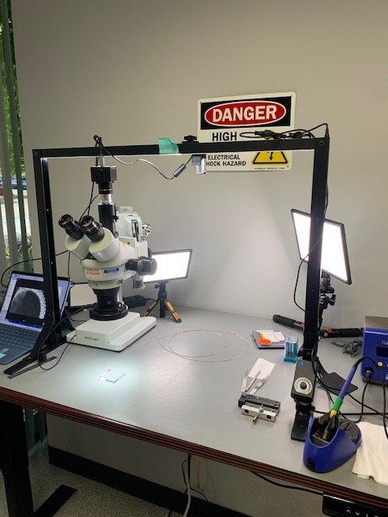

The project commenced in **XX, 2024**, with the initial filming taking place onsite at **XXX**.



### Production Equipment Used  
```
- PROAIM 3ft Overhead Platform  
- AmScope MU Camera (with Adapter)  
- LED SoftLight (adjustable color temperature)  
- Sound capturing devices  
- Post-production tools, including AI-enhanced software  
```
### Acknowledgments  
This production would not have been possible without the contributions of the dedicated team.  **Special recognition goes to:**  
- J. Rick  
- P. Shaw  
- L. Chen 
