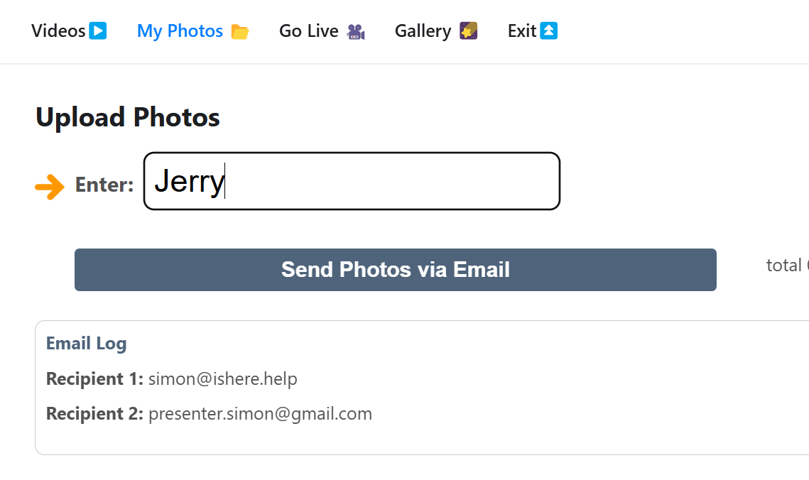
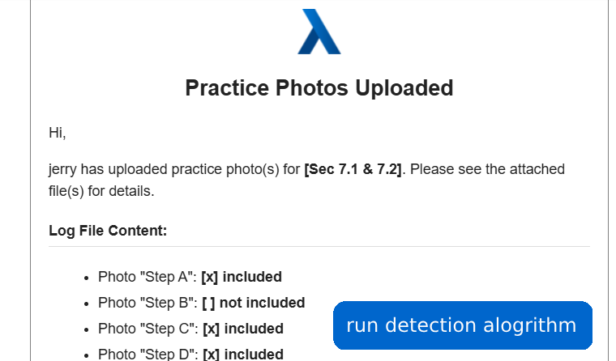
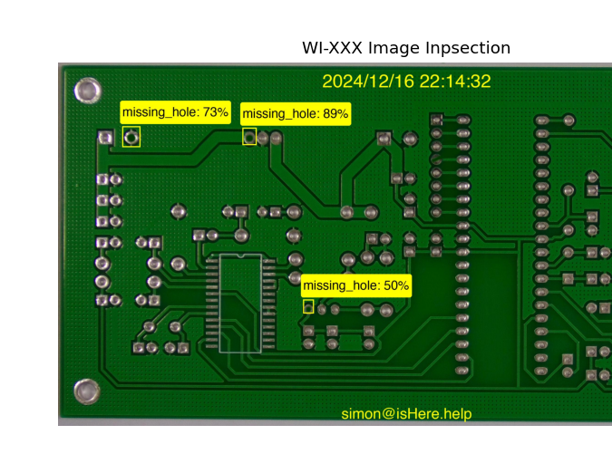

## Certification via AI

workflows:
```
1. Operator Uploads Photos  
2. Optional Intermediate Step: Supervisor Review  
3. AI Result  
```
---

### Operator Upload Photos
>>
>>*Caption*: Operator uploads photos for inspection, logs email recipients, and sends the images via email.

---

### (Optional) Supervisor Review
>>
>>*Caption*: Notification email generated, showing which photos are included and pending review.

---

### AI Inspection Result
>>
>>*Caption*: AI-inspection identifies missing holes with confidence percentages and highlights them on the PCB.

**Target** Errors:  
```
- Missing Hole  
- Mouse Bite  
- Open Circuit  
- Short  
- Spur  
- Spurious Copper 
``` 
---

### Underlying Technologies
>>- Object Detection Models (YOLO v8 or other)
>>- Data augmentations via tools (eg Roboflow)
>>- Image Annotation and Confidence Scoring
>>- Public Datasets: "PCB Defects" (Kaggle)