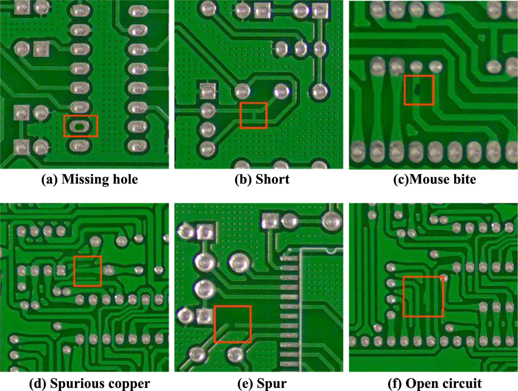

# Avoid These Errors

Here, we highlight key issues to watch for during operations and SOP execution.

## Common Pitfalls to Avoid  

1. **Skipping Steps**  
   Follow the SOP procedures carefully to ensure no step is missed, which could compromise the final output.

2. **Improper Tool Usage**  
   Ensure you are using the correct tools and equipment for each step as specified.

3. **Inconsistent Inspections**  
   Regular and detailed inspections help maintain high-quality standards and identify issues early.

4. **Ignoring Safety Guidelines**  
   Always adhere to safety protocols to protect both operators and products.

5. **Lack of Documentation**  
   Properly documenting each process ensures traceability and accountability.

---
