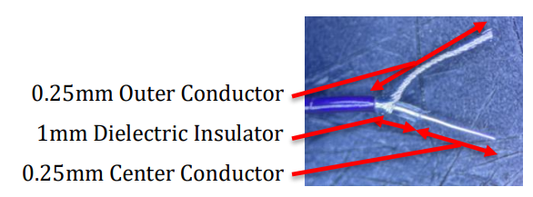
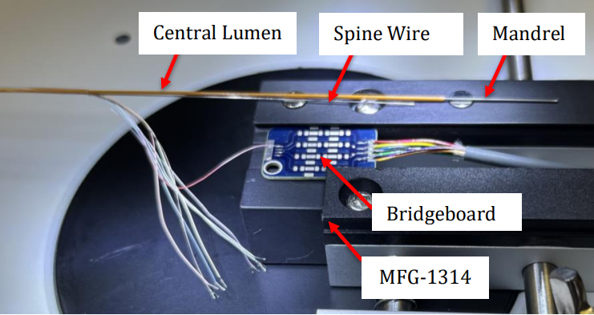
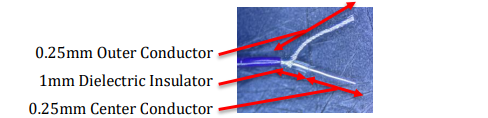
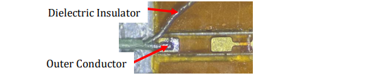

# 7.1 Proximal End of Cables

### 7.1.1 
Insert a 0.0195” Teflon coated stainless steel mandrel through the proximal end of the central lumen of the catheter for approximately 5cm length. Allow approximately 5 cm length exposed for later extraction in subsequent steps.

**Figure 1**: Example of micro-coaxial cable.

### 7.1.7 
Place the bridgeboard circuit from the Cable Subassembly in the circuit board holder.

### 7.1.8 
Fix the inner lumen with pre-loaded mandrel and spine wire to the magnet to prevent heat damage from the soldering tip.

**Figure 2**: Placement of catheter subassembly and catheter cable onto circuit board holder.

### 7.1.9 
Pre-wet the circuit ground and signal for catheter joints using solder and a Soldering Station on both the front and back sides of the bridgeboard circuit.

### 7.1.10 
Using tweezers, hold the outer conductor wires against the pre-wetted circuit ground. Solder the conductor wires to the circuit using a soldering station set to 350°C. Cut the excess conductor wires 

from the Bridgeboard circuit using a blade breaker as necessary. As the following steps are performed, ensure that colors are electrically connected to the bridgeboard per specification.

### 7.1.11 
Using tweezers, hold the insulator jacket adjacent to the pre-wetted circuit signal pad. The exposed center conductor wires should be between 25% to 75% of the full length of the pre-wetted circuit signal pad.

 Solder the conductor wires to the circuit using a soldering station set to 350°C. Cut the excess conductor wires from the Bridgeboard circuit using a blade breaker as necessary.

### 7.1.12 
Clean the circuit from excess solder as necessary using an antistatic swab and 70% alcohol.

### 7.1.13 
Repeat steps 7.1.11 thru 7.1.12 for the back face of the bridgeboard circuit.

### 7.1.14 
In-process inspection: Perform a visual inspection of the soldered conductors.
- **Verify**: Color order of coaxial cables is positioned as specified in the drawing.
- **Pass**: Both outer conductor and center conductor are tinned to their pads (ground and signal, respectively).
- **Pass**: Center conductor is on 25-75% length of signal pad and does not exceed boundaries of the pad.
- **Pass**: Dielectric insulator is adjacent (up to) or past the signal pad.
- **Pass**: Dielectric insulator is not melted or otherwise deformed by heat.
