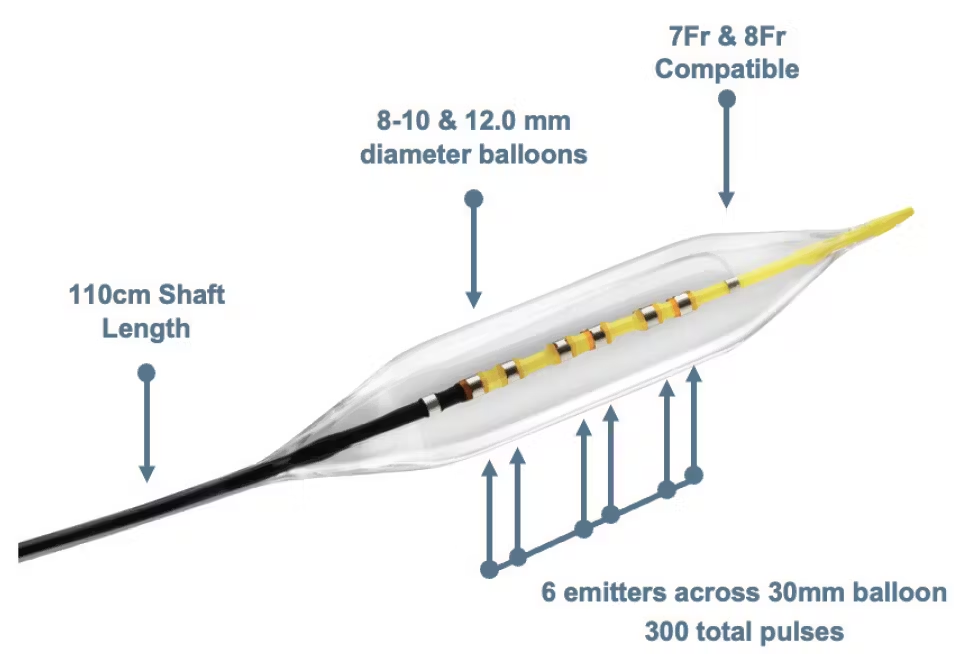

# **Standard Operating Procedure (SOP) for IVL™ Catheter Assembly**

**Document ID:** MIN-0434-C-SOP  
**Product:** IVL™ Catheter  
**Version:** 1.0  
**Scope:** This document provides standard operating procedures for assembling the **0.018” SLT IVUS Support Crossing Catheter** used in intravascular lithotripsy (IVL) procedures.

---

## **1. Safety & Precautions**

- Follow **Electrostatic Discharge (ESD)** protocols when handling transducer components **(Ref: SOP-0299)**.
- Ensure all adhesives and solder materials are used in a **well-ventilated area**.
- Use **UV protective eyewear** when operating the **UV curing system**.
- Maintain a **clean and controlled environment** to prevent contamination.

---

## **2. Required Materials & Tools**

| Component/Tool   | Description                                      |
| ---------------- | ------------------------------------------------ |
| **PRT-0427-026** | Teflon-coated stainless steel mandrel (0.0195")  |
| **MFG-1201**     | Hakko FX-971 soldering system                    |
| **PRT-0429-007** | Platinum-cured silicone tubing (0.040” x 0.065”) |
| **CON-1218**     | Water-soluble flux (1 gallon)                    |
| **Asset#0374**   | Dymax 4x light guide UV curing system            |
| **MFG-1318**     | Transducer alignment tool (0.034” OD Octagon)    |
| **CON-0345**     | Two-part adhesive mixer nozzle                   |
| **MFG-0351**     | Phillips screwdriver No.1 (6-3/4in Length)       |

For a **full list of tools and materials**, refer to the **Materials & Equipment** document.

---

## **3. Assembly Steps**

### **0434.1 Prepare the Guidewire Lumen**
- Cut the **guidewire lumen (118)** to the required **functional length (150cm)**.
- Inspect the lumen **outer surface (218S)** for defects or irregularities.
- Position the **plasma generator (133)** within the guidewire lumen.
- Secure the **plasma generator (133)** using **medical-grade adhesive**.
- Allow the adhesive to cure **for 30 minutes at room temperature**.

### **0434.2 Attach the Energy Guide**
- Cut the **energy guide (122A)** to match the catheter length.
- Align the **guide distal end (122D)** adjacent to the **outer surface (218S)** of the **guidewire lumen**.
- Secure the energy guide using **thermal welding** or **micro-adhesives**.
- Ensure that the **energy guide (122A) can transmit laser energy efficiently**.

### **0434.3 Assemble the Catheter Body**
- Insert the **guidewire lumen and energy guide subassembly** into the **catheter body**.
- Attach **strain relief components** to reduce mechanical stress.
- Secure the catheter with **polymer bonding** at key junctions.

### **0434.4 Energy Source Integration**
- Connect the **energy guide (122A) to the energy source (124)**.
- Ensure proper **optical alignment** for efficient energy transfer.
- Perform **continuity and impedance tests** to verify functionality.

### **0434.5 Quality Assurance & Testing**
- Conduct **pulse echo testing** to validate signal transmission.
- Perform **dimensional and visual inspection** for defects.
- Verify **electrical impedance compliance**.

### **0434.6 Final Packaging & Sterilization**
- Seal the catheter in **medical-grade pouches**.
- Sterilize using **ethylene oxide (EtO) or gamma radiation**.
- Label with **lot number, expiration date, and compliance markings**.

---

## **4. Inspection & Documentation**

- Record **UV intensity measurements** daily.
- Document **adhesive curing times** and test results in **production logs**.
- Follow **internal SOP guidelines** for process control.

---

## **5. Training & Certification (Extended Version Only)**

Each of the 6 steps above serves as an individual training certification module. Operators must demonstrate:

### **Training Criteria:**
1. **Basic Science & Context:**
   - Understanding of the fundamental principles behind catheter operation and IVL technology.
   - Broader medical implications and purpose of the device.

2. **Procedure Rationale:**
   - Why each step is performed in a specific way.
   - How it contributes to overall product integrity.

3. **Failure Analysis & Risk Awareness:**
   - Potential consequences of errors in assembly.
   - Safety concerns and regulatory compliance risks.

**Certification Process:**
- Completion of theoretical training.
- Hands-on demonstration of each step.
- Evaluation by a senior technician or quality assurance lead.

---

This document serves as both the **Standard Operating Procedure (SOP) Inventory** and the **Extended Training Preparation Guide**. Let me know if additional modifications are required!

