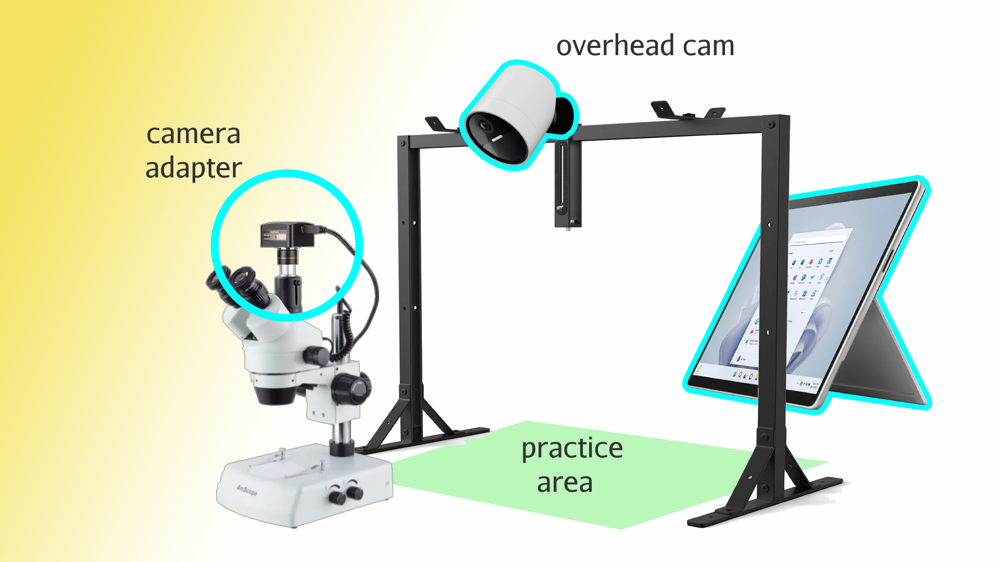
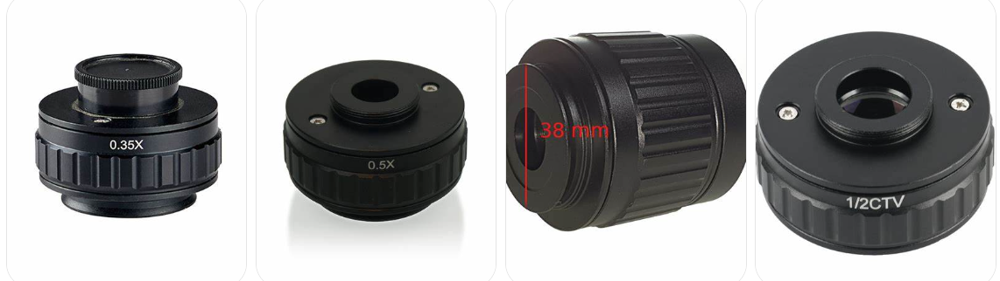

# Microscopic Precision

In medical device manufacturing, precision matters. With **Microscopic Precision**, our kiosk platform empowers clients to inspect critical components at the most granular level. This feature ensures that no flaw goes unnoticed, safeguarding the integrity and reliability of your devices.

## Adaptive Design

| Magnification | Adapter Type | Description                                                  | Usage Case                                                                 |
|---------------|--------------|--------------------------------------------------------------|---------------------------------------------------------------------------|
| **0.3X**      | C-Mount      | Provides a wider field of view by reducing magnification.     | Ideal for zooming out to capture large objects or wide PCB layouts.       |
| **0.5X**      | C-Mount      | Balances field of view and detail for moderate magnification. | Suitable for inspecting medium-sized features like solder joints.         |
| **1X**        | C-Mount      | Retains the original magnification of the microscope.         | Best for zooming into fine details like individual solder joints or cracks.|

With **Microscopic Precision**, you can see accuracy in its purest form.