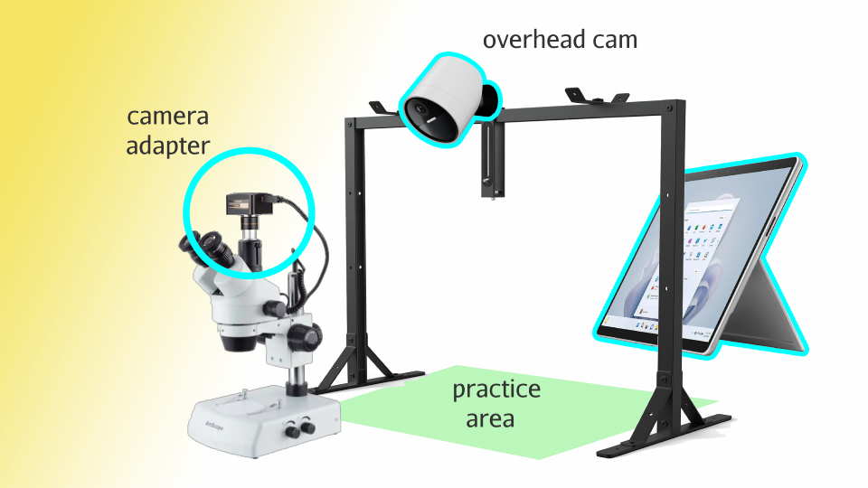

# **Bring Star Trainers to Your Restricted-Access Production Environment**  
**Skip the hassle of securing security clearances.**  

Many **high-value production facilities** operate in **restricted-access environments** with **tight security controls**, preventing independent experts—including **star trainers**—from entering.  

Our service removes these barriers by **delivering expert instruction remotely**, providing **live, hands-on training and certification** without the need for security clearances. With real-time guidance, your team gains direct access to **specialized expertise**, ensuring **precision, compliance, and operational excellence**—right where the work happens.  

---

## **🚀 Get Started**  
🔹 **On-Site Training | Live Instructor Guidance**  

### **1️⃣ Connect Your Microscope to the Kiosk**  
📌 Ensure proper setup for real-time inspection and remote instructor guidance.  

  

### **2️⃣ Let Our Star Trainer Guide You Live and Hands-On**  
📌 Follow real-time instructions or request direct expert guidance for your task.  

  
