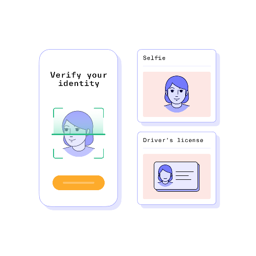

## User Face ID Login

 

| **Step**                     | **Description**                                                           |
|-------------------------------|---------------------------------------------------------------------------|
| **Step 1: Photo ID Register**          | Scan QR to URL on phone; Liveness Face + photo ID (both sides)                        |
| **Step 2: Face Log-in to Kiosk**   | Facial recognition (portrait camera); Detects liveness through movement   |
| **Step 3: My Wallet**         | Stores certificates in open OnBadge format                               |
| **Step 4: Forward Certificates** | Forward to email/phone for personal use/safe keeping                   |
| **Step 5: Ubiquous Retrieval** | View or examine the Certificates anywhere anytime|