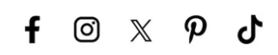

## My Certificates


**Certificate: Coaxial Soldering and Assembly**

**Skills Acquired:**
```
- Soldering of micro-coaxial cables using a microscope
- Assembling and adjusting microcomponents in a controlled environment
- Applying solder paste and preparing conductors with precision
- Conducting thorough inspections to meet quality standards
```

---

### Certificates (click to share)
Please select the current status of your certification:  

- [XXXXX ] **Pass**  
- [XXXXX ] **Pending**  
- [XXXXX ] **No Pass**  


---

[**Talk to Tutor**](#)
