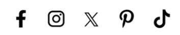

## Click on Certificate to [save] or [share] ##

### Badge
**Course Taken**:  
Coaxial Soldering and Assembly

**Skills Acquired**:

- Soldering of micro-coaxial cables using a microscope
- Assembling and adjusting microcomponents in a controlled environment
- Applying solder paste and preparing conductors with precision
- Conducting thorough inspections to meet quality standards

---

## Share and Make Known ##

[**Talk to Tutor**](#)
